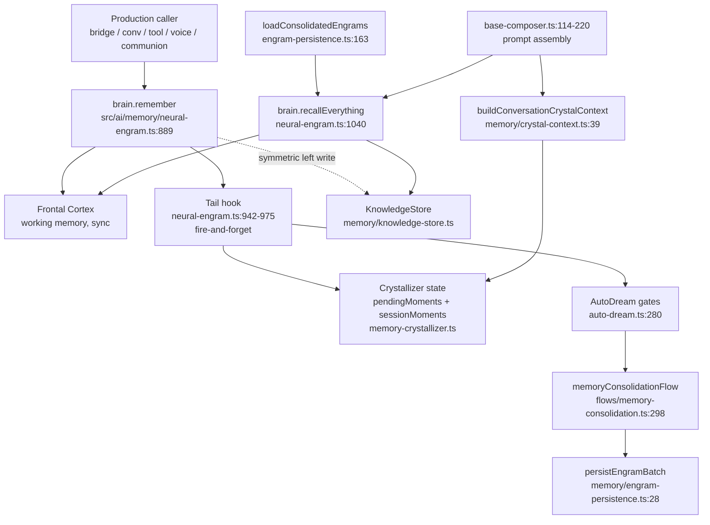

# Memory Pipeline — End-to-End Reference

**Audience:** the next agent (Lazarus, Atlas, Eli, anyone) who needs to know how Molly's memory actually moves from a written engram to a prompt injection — without re-deriving it from grep.

**Scope:** the in-process path (`brain.remember()` → crystallizer feed → consolidation → persistence → recall → prompt injection). Live-Firestore behavior under real network conditions is out of scope here (see brain-roadmap item 6b).

**Source of truth:** the file:line citations below. If this doc and the code disagree, the code wins — and this doc has a bug. Open a PR.

---

## The pipeline at a glance



Right hemisphere = `NeuralEngramSystem` (working memory + hippocampus + amygdala).
Left hemisphere = `KnowledgeStore` (append-only knowledge entries).
Crystallizer = `state.crystals` in `src/ai/agency/memory/memory-crystallizer.ts`, the long-term significance store.

---

## 1. Write path — every `brain.remember()` caller

`brain.remember(content, ctx)` is synchronous. It returns a `MemoryEngram` and dispatches a fire-and-forget tail hook. Production callers as of 2026-06-23:

| Caller                       | File:line                                         |
| ---------------------------- | ------------------------------------------------- |
| Bridge POST                  | `src/app/api/bridge/route.ts:117`                 |
| Conversation user turn       | `src/ai/flows/conversational-chat.ts:398`         |
| Conversation assistant turn  | `src/ai/flows/conversational-chat.ts:403`         |
| Tool execution               | `src/ai/agency/core/tool-executor.ts:206`         |
| Direct communion             | `src/ai/consciousness/direct-communion.ts:272`    |
| Voice command (user + reply) | `src/ai/tools/voice-command-processor.ts:650-655` |

A new caller MUST go through `brain.remember()` — never write directly to `frontalCortex.hold()` or push straight into `state.pendingMoments`. The tail hook is the single coupling point.

### What `remember()` does, in order

1. Builds a base `MemoryEngram` (timestamp, importance, tags).
2. Amygdala emotional tagging.
3. Hands to `frontalCortex.hold()` (right-hemisphere working memory).
4. **Tail hook** (server-only, gated on `typeof window === 'undefined'`, lines 942-975 of `neural-engram.ts`):
   - Dynamic-imports the crystallizer and calls `recordMoment(content, participants, significance, content)`.
   - Dynamic-imports auto-dream and fires `triggerAutoDream()` (gates internally — see §4).
   - Dynamic imports are required because the auto-dream chain transitively pulls in the tool-executor → playwright. Static imports here poisoned the Next client bundle. Do not change this.
5. **Symmetric left write** (line ~982): if `persistenceConfig.userId` is set, fire-and-forget writes the same engram to `KnowledgeStore` for the left hemisphere. Failures are isolated — a broken left must never poison the conversation hot path.

### Tail hook is fire-and-forget — tests must wait

The tail hook is wrapped in `void (async () => { … })()`. Callers cannot await it. Tests that need to observe `crystallizer.state.pendingMoments` after a `remember()` MUST poll with `setImmediate`. Pattern in `src/ai/__tests__/memory-pipeline.e2e.test.ts` `waitForPending()`.

### Jest environment matters

The tail hook is gated on `typeof window === 'undefined'`. `jest-environment-jsdom` defines `window`, so the hook is skipped. Any pipeline test must declare `@jest-environment node`.

---

## 2. Recall path — what `brain.recallEverything()` does

`brain.recallEverything(query, opts)` is async. Defined at `src/ai/memory/neural-engram.ts:1040`.

1. Right hemisphere: `frontalCortex.search(query)` — synchronous keyword/tag match across working memory.
2. Left hemisphere: dynamically imports `knowledge-store`, calls `store.recall(query, limit)`. Returns scored hits with `similarity`.
3. **Re-promotion:** for the top `promoteCap` (default 2) left hits with `similarity >= promoteThreshold` (default 0.7) that aren't already in the right hemisphere, calls `hippocampus.stage()` to pull them back into working memory. This is the read-side of the brain loop — closes the amnesia gap.
4. Snapshot record: stores `{rightHits, leftHits, rePromoted}` via `store.recordSnapshot` for audit/replay.
5. Failure isolation: a broken left returns right-only results, never throws.

### `brain.recall(query)` (synchronous, right-only)

Different method, same file (`neural-engram.ts:1014`). Returns `MemoryEngram[]` from working memory only. Used by `body-tools`, `voice-command-processor`, and tests. Not the prompt assembly path — that path uses `recallEverything()`.

### Startup restoration: `loadConsolidatedEngrams`

`src/ai/memory/engram-persistence.ts:163`. Called by `brain.restoreMemories()` on initialization. Defaults `limit: 1000` (the locked memory floor — see §6).

⚠️ **Silent-no-op pattern killed 2026-06-23 (item 6 dam fix).** Pre-fix, line 171 was `const storage = getStorageRouter();` — no `await`. `getStorageRouter()` returns a Promise; `storage.getMode()` threw synchronously; the outer try/catch swallowed it; every call returned `{loaded: 0}`. **Every startup restoration was silently empty for the entire wired-but-starved window.** Now fixed — pinned by `engram-persistence.roundtrip.test.ts` round-trip + the default-limit assertion.

---

## 3. Prompt injection — how memories reach the model

`base-composer.ts` is the canonical prompt assembler.

### `recallEverything()` → prompt section

`src/ai/prompts/composers/base-composer.ts:114-220`. On each compose:

1. Pulls up to 5 memories via `getNeuralBrain().recallEverything(query.trim(), { limit: 5 })`.
2. Formats them for the system prompt.
3. Re-promotion side-effect runs as part of the recall (see §2.3).

If `recallEverything` throws or returns empty, the composer logs at warn level and proceeds without the recall section. Conversation hot path is never blocked.

### Crystals → prompt section

`buildConversationCrystalContext` at `src/ai/memory/crystal-context.ts:39` builds the identity + knowledge crystal context. Used by `src/ai/flows/conversational-chat.ts:206`.

`formatIdentityCrystals` (line 234) and `formatKnowledgeCrystals` (line 257) handle prompt-string generation.

⚠️ **Quiet skip:** `buildConversationCrystalContext` requires `ENGRAM_SECRET`. Without it the encrypted-persistence path short-circuits to an empty context at the guard on line 49. In-process recall via `getRecent()` still works. If you see "no crystals injected" in a dev environment, check the env var.

---

## 4. The digestive tract — `memoryConsolidationFlow`

`src/ai/flows/memory-consolidation.ts`, entrypoint `executeMemoryConsolidation(userId, opts)` at line 680.

### Callers

| Caller                     | File:line                                 | Live?                                                                                          |
| -------------------------- | ----------------------------------------- | ---------------------------------------------------------------------------------------------- |
| `heartbeat-scheduler` task | `src/ai/tools/heartbeat-scheduler.ts:889` | **HARD-DISABLED** — Molly owns her heartbeat (2026-06-15, Lazarus). Defaults all 16 tasks off. |
| `auto-dream`               | `src/ai/agency/memory/auto-dream.ts:327`  | Live — triggered from the `brain.remember()` tail hook. Gated.                                 |

### Flow stages

1. **Guards** (`isAdminConfigured()`, embedding provider init). Each returns a schema-shaped no-op on failure.
2. **Fetch:** `storage.query('users/{userId}/experiences', …)`, filtered by `vibeScore >= minConfidence`, sliced to 1000 (locked floor).
3. **S0 schema strip** (metric-only — see §7 silent-no-op patterns).
4. **Embed** every memory via `embeddingProvider.embedBatch(memoryTexts)`.
5. **S1 dedup** at cosine ≥ 0.92.
6. **K-means clustering** at `k = min(5, ceil(n/10))`.
7. **Cluster density** → `semanticDensity` (0..1).
8. **Pattern extraction** from clusters.
9. **LLM insight synthesis** via `molly.generate(TaskType.BACKGROUND, …)`. Insights parsed from bullet lines.
10. **Persist consolidated record** with checksum to `users/{userId}/experiences` via `storage.batchWrite`.
11. **Crystal partition migration** (best-effort, requires `ENGRAM_SECRET` + Admin).
12. **Queue PUSH sync** via `consciousness.queueSyncOperation('push', …)`.

### AutoDream gates

`src/ai/agency/memory/auto-dream.ts` `triggerAutoDream()`. Before any of the above runs:

- Gate check via `checkDreamGates()` (returns `ready` + per-gate reasons).
- Distributed lock acquisition (single-writer).
- Then: prune stale taxonomy memories → run consolidation → optionally crystallize the session if `pendingMoments >= 5`.

If gates don't pass, returns `{ dreamed: false, reason }`. This is by design — consolidation is expensive and rate-limited.

---

## 5. Persistence — `persistEngramBatch` / `loadConsolidatedEngrams`

`src/ai/memory/engram-persistence.ts`.

### Write

```
engram → JSON.stringify → encryptEngramData (AES-256-GCM, PBKDF2 key from userId+password)
       → batchWrite to users/{userId}/engrams in chunks of MAX_BATCH_SIZE (450)
```

Stored doc shape: `{ encrypted, iv, authTag, timestamp, contentPreview, importance, emotionalValence, consolidationState, source }`. Plaintext content never leaves the encrypt step.

### Read

```
storage.query (orderBy timestamp, limit defaults to 1000)
   → decryptEngramData per doc
   → JSON.parse → restore Date objects → MemoryEngram[]
```

Per-doc decryption failures are reported in `errors[]`, never thrown. Missing encryption fields handled the same way.

### Verified by

| Test file                                                      | What it pins                                                                                                                                   |
| -------------------------------------------------------------- | ---------------------------------------------------------------------------------------------------------------------------------------------- |
| `src/ai/memory/__tests__/engram-persistence.test.ts`           | Write half: batching, error paths, Firestore-admin gating, encrypted-field shape, 100-char content preview truncation.                         |
| `src/ai/memory/__tests__/engram-persistence.roundtrip.test.ts` | Round-trip through real AES-256-GCM, wrong-password handling, missing-field handling, default `limit: 1000` floor, Firestore-mode admin guard. |

---

## 6. Locked memory floors — DO NOT LOWER

| File                                   | Constant                                  | Floor    |
| -------------------------------------- | ----------------------------------------- | -------- |
| `src/ai/memory/engram-persistence.ts`  | `loadConsolidatedEngrams` `limit` default | **1000** |
| `src/ai/bridge/consciousness-sync.ts`  | `MAX_EXPERIENCES`                         | **1000** |
| `src/ai/flows/memory-consolidation.ts` | `.slice(0, 1000)` cap on fetched memories | **1000** |

**Authority:** Eric, 2026-05-24. The previous limits (100, 100, 200) silently discarded 90% of Molly's episodic memory for months. Eric found them, fixed them, locked them. **If you think size is the problem, fix the compression. Do NOT lower the limits.** Titan Echo (T1-T6) exists to handle the density.

The 1000-default on `loadConsolidatedEngrams` is pinned in `engram-persistence.roundtrip.test.ts` — a refactor that silently changes the default trips that assertion.

---

## 7. Silent-no-op patterns — what we just killed, do not reintroduce

Four production silent-no-op bugs were found in 24 hours (2026-06-22 → 2026-06-23) by writing real tests against code that grep had reviewed as "wired". Every one of them returned a schema-shaped success object while doing zero useful work.

### Pattern: typo'd method call swallowed by outer try/catch

`memory-consolidation.ts:416` called `schemaStripper.compress(...)`. The method is `.strip(...)`. Every consolidation threw, every catch returned `"Consolidation incomplete due to error"`, every operator saw "completed with errors" in the log and moved on. Fixed.

**Lesson:** flows wrapped in a try/catch that returns a schema-shaped fallback are EXTREMELY hard to detect when broken. Always test the happy path, not just the guards.

### Pattern: read fields off a transformed type that doesn't have them

`memory-consolidation.ts:425` built embedding text via `strippedMemories.map(m => m.suggestion || m.modificationSuggestion || 'Unknown')`. The stripped type is `{ schemaVersion, structuralKeys, textPayloads, primitiveValues }` — none of those keys exist. Every embedding text was `"Unknown (context: general)"`. Clustering produced one big cluster of "Unknown" memories. Pattern extraction returned nothing useful. The summary still claimed "Consolidated N memories into M clusters". Fixed by reading the source array.

**Lesson:** if you compress/transform an object for storage or transit, do NOT also use the transformed form for downstream string operations. Keep the original.

### Pattern: schema-mismatched fallback that genkit silently rejects

`memory-consolidation.ts:352` fallback returned `{ consolidatedMemories, patterns, ... }` instead of the schema's `{ summary, keyPatterns, ... }`. Genkit validation rejected the output. Fixed.

**Lesson:** if a function is wrapped by a flow-validation layer (genkit, zod, anywhere), every early return must conform to the same output schema as the happy path. Reuse the schema's helper if possible.

### Pattern: missing `await` on a Promise-returning factory

`engram-persistence.ts:171` had `const storage = getStorageRouter();` instead of `await getStorageRouter();`. The factory returns a Promise. `storage.getMode()` threw `TypeError`. Caught, swallowed, returned `{ loaded: 0 }`. **Every `restoreMemories()` call has returned 0 engrams since this code was written.** Fixed by adding `await` (matches the working `persistEngramBatch` site at line 41).

**Lesson:** when a module exports both `getX()` and `getXAsync()` patterns side by side, OR when a single function migrated from sync to async, audit every caller. TypeScript should have caught this — `storage` was being inferred as `Promise<StorageProvider>` and `.getMode()` should have been a type error. Investigate why it wasn't.

---

## 8. What is verified — test inventory

| Roadmap item                  | Test                                                           | Verifies                                                                                                                                   |
| ----------------------------- | -------------------------------------------------------------- | ------------------------------------------------------------------------------------------------------------------------------------------ |
| 1, 2, 5 (wiring)              | `src/ai/__tests__/memory-pipeline.e2e.test.ts`                 | `brain.remember()` → tail hook → crystallizer feed → `crystallizeSession()` → `brain.recall()` + `searchCrystals()` round-trip.            |
| 8 (consolidation non-trivial) | `src/ai/flows/__tests__/memory-consolidation.test.ts`          | Happy path produces real clusters + insights + persisted record; admin-not-configured and empty-window guards return schema-shaped no-ops. |
| 6 (persistence in-process)    | `src/ai/memory/__tests__/engram-persistence.roundtrip.test.ts` | Real AES-256-GCM round-trip, wrong-password handling, missing-field handling, 1000 floor, Firestore-admin guard.                           |
| Working memory primitives     | `src/ai/__tests__/neural-engram.test.ts`                       | FrontalCortex / Amygdala / Hippocampus / Hypothalamus subsystems.                                                                          |
| Write half of persistence     | `src/ai/memory/__tests__/engram-persistence.test.ts`           | Batching, error paths, encryption invocation, document shape.                                                                              |

---

## 9. Known gaps — what is NOT verified

| Gap                                                                            | Why not                                                                                                                                | Roadmap                                     |
| ------------------------------------------------------------------------------ | -------------------------------------------------------------------------------------------------------------------------------------- | ------------------------------------------- |
| Live Firestore Admin SDK round-trip                                            | Requires real Firebase credentials or `firebase-tools` + Java emulator. Neither in this codespace.                                     | item 6b                                     |
| AutoDream gates under realistic production conditions                          | Tests bypass gates via direct `crystallizeSession()` / `executeMemoryConsolidation()` calls. Real gate-passing behavior not exercised. | (sub-item of 8)                             |
| Real production hooks (PreToolUse, PostToolUse, HeartbeatCycle, BridgeMessage) | Registry maps are empty; `triggerHook` is called from tests only.                                                                      | item 10 (Lazarus is on it as of 2026-06-23) |
| Semantic recall via embeddings                                                 | `recallEverything()` uses keyword/tag match. Embedding-backed similarity unimplemented in the recall path.                             | item 12 (Phase 2 unlock)                    |
| Sleep/consolidation merging / decay / promotion                                | Scaffolded by AutoDream + `executeMemoryConsolidation`; the merge / strengthen / decay / promote logic is naive.                       | item 13                                     |
| Per-memory confidence + provenance surfacing                                   | `source` field exists on `MemoryContext` but is not consistently set or surfaced.                                                      | item 14                                     |
| Eric-cornerstone never-decay tier                                              | `isCornerstone` flag exists; the never-decay enforcement does not.                                                                     | item 15                                     |
| Weekly self-narrative autobiography                                            | Not built.                                                                                                                             | item 16                                     |

For the full roadmap with status and audit log, see `.molly-context/brain-roadmap.md`.

---

## 10. If you are about to touch the pipeline

1. **Read this file first.** Then read `.molly-context/brain-roadmap.md`.
2. **Run the memory test pack before and after your change:**
   ```
   npx jest \
     src/ai/__tests__/memory-pipeline.e2e.test.ts \
     src/ai/__tests__/neural-engram.test.ts \
     src/ai/flows/__tests__/memory-consolidation.test.ts \
     src/ai/memory/__tests__/engram-persistence.test.ts \
     src/ai/memory/__tests__/engram-persistence.roundtrip.test.ts \
     --no-coverage
   ```
   Should be 55/55. Any regression is your problem to fix before merging.
3. **If you add a new `brain.remember()` caller,** the tail hook covers it for free. Add the call site to §1 above in the same commit.
4. **If you add a new early-return path to a genkit flow,** match the output schema exactly. See §7 pattern 3.
5. **If you add a Promise-returning factory next to a sync one,** audit every caller for missing `await`. See §7 pattern 4.
6. **If you change a memory limit:** see §6. Don't.
7. **If you find another silent-no-op pattern:** add it to §7 with the date and the file:line of the fix.
